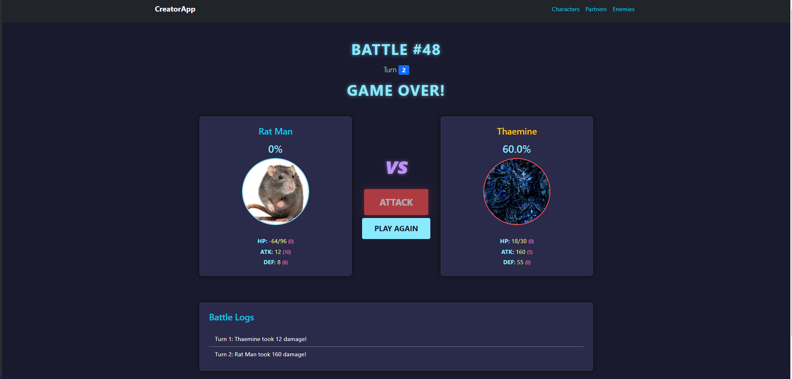
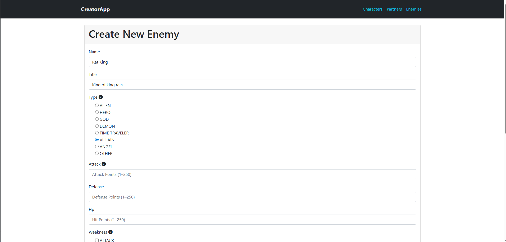
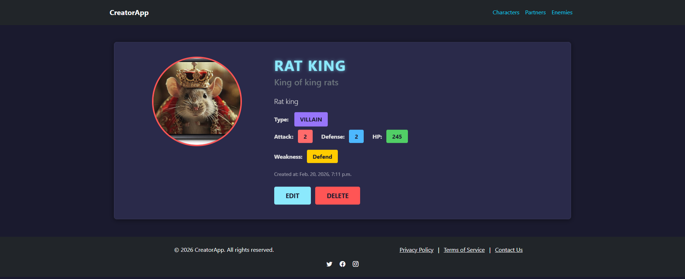

# A Django app for a turn-based battle game where users create their own characters and enemies.

# Why This Project Exists

```
This project was built to demostrate my experience with Django and PostgreSQL , 
speciffically database design and relationships,implementing simple CRUD operations, 
implementing forms , data validation , Django class and function based views , 
templates with dynamic data rendering.
```

# Features

- Really simple (for now) turn based battle system

- CRUD operations on all characters,partners and enemies

- Stat, role and type selection on creation that involves strategy to make your characters the strongest
- 2 vs 1 battle between Character and their Partner against strong Enemy with battle logs
- Contact form, about page , WIP page, 404 page
- AI generated frontend design with the help of Gemini CLI



# App responsibilities

- common - stores in one place models,choice fields and custom tags that are used in all other apps
- characters - handles everything about character creation,edit and deletion and contains the landing page.
- partners - handles everything about partner creation,edit and deletion.
- enemies - handles everything about enemy creation,edit and deletion.
- contacts - handles the display of wip.html and about.html and contains a contact form. Currently after submiting the form you can only view the content inside the admin panel.
- battle - handles the process of selecting characters,partners and enemies to fight each other. Then handles the creation of the battle and stores the character and enemy adjusted stats into a temporary model only for the current fight.Handles the fight logic.


# Project Notes

- Currently during battle you can only attack. I plan to add option to defend,heal,buff and shield in the future. Also I plan to give more moves to the enemy and make it's turns automatic.
- The defense stat currently does nothing.
- Different Types and Roles buff your character stats when entering combat which allows them to reach higher than the set amount on creation.
- Enemy weakness reduces the enemy stats depending on the character they fight.
- Partners only function currently is to add their stats to their character partner on game start.


# Tech Stack

- Python
- Django
- PostgreSQL

# Installation 

1. Clone the repository

```bash

git clone https://github.com/Ivanivanov-it/CreatorApp.git
cd CreatorApp
```

2. Create virtual environment

```bash

python -m venv venv
source venv/bin/activate # Linux/Mac
venv\Scripts\activate # Windows
```

3. Install dependencies

```bash

pip install -r requirements.txt
```

4. Configure environment variables

Create .env file in the project root:

```
SECRET_KEY=generate_your_own_key
DEBUG=False

DB_PORT=5432
DB_NAME=your_db
DB_USER=your_user
DB_PASSWORD=your_password
DB_HOST=127.0.0.1
```

Use this command to generate your own secret key:

```bash

python -c "from django.core.management.utils import get_random_secret_key; print(get_random_secret_key())"
```

5. Run migrations

```bash

python manage.py migrate
```

6 Start server

```bash

python manage.py runserver
```